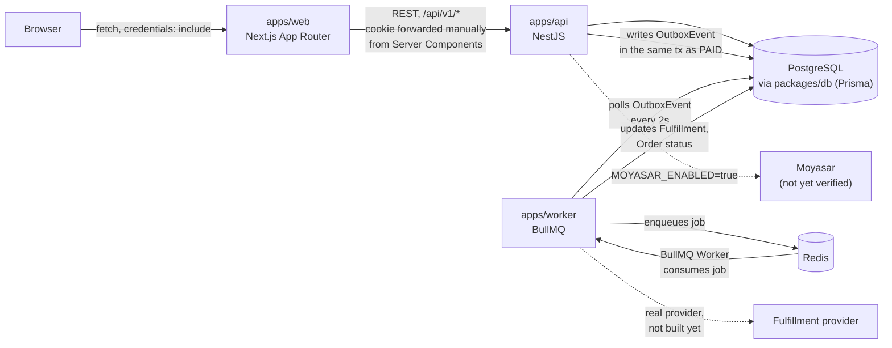
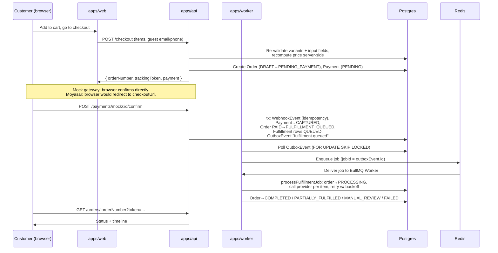

# Architecture

## System overview

Three deployables (`apps/web`, `apps/api`, `apps/worker`) share code through workspace
packages (`packages/{db,contracts,ui,i18n,config}`), never by importing across `apps/*`
directly. `packages/db` is the only thing that talks to Postgres; `apps/web` never
touches the database — it only calls `apps/api` over HTTP.

## Why an outbox instead of calling the worker directly

`PaymentsService.processGatewayEvent` (in `apps/api`) writes an `OutboxEvent` row inside
the *same* Prisma transaction that moves the order `PAID → FULFILLMENT_QUEUED` and
creates the `Fulfillment` rows. If the API called the worker directly (an HTTP call, a
direct queue push outside the transaction), a crash between "order marked PAID" and
"fulfillment triggered" would silently lose the fulfillment step — the payment would be
captured but nothing would ever ship. Writing the event in the same transaction makes it
atomic with the state change it announces: either both happen, or neither does, and the
worker's outbox dispatcher (`apps/worker/src/outbox/outbox-dispatcher.ts`) will always
eventually find and relay any event that was committed, even after a crash.

## Why money is always an integer

Every amount in the schema and every contract (`packages/contracts/src/pricing.ts`) is
an integer in minor units (halalas, not riyals) — never a float, never a `Decimal`
carried through arithmetic. `computePriceBreakdown` does base cost → margin → discount →
tax entirely in integers, rounding at each step. This is what
`docs/PAYMENT_INTEGRATION.md` and `docs/ORDER_STATE_MACHINE.md` build on: a payment's
`amountMinorUnits` is compared for exact equality against what the order expects before
a webhook is trusted (see `PaymentsService.processGatewayEvent`).

## Why the order state machine lives in `packages/db`, not `apps/api`

`OrderStateMachine` (`packages/db/src/order-state-machine.ts`) started in `apps/api` and
was moved once `apps/worker` needed the exact same transition rules — see git history on
the Phase 4 commit. It's framework-agnostic (no NestJS import) specifically so both the
API and the worker depend on one definition of "which transitions are legal," rather than
two copies that could drift apart.

## Request flow: checkout → payment → fulfillment

## Monorepo layout

See the README for the full stack list. Build dependency order (enforced by
`turbo.json`'s `dependsOn: ["^build"]`): `contracts` → `db` → `{api, worker}`; `web`
depends on `contracts`/`ui`/`i18n` but consumes them as TypeScript source directly via
Next.js's `transpilePackages`, not a compiled `dist/`.

One thing worth knowing if you touch `packages/contracts` or `packages/db`: both compile
to a real CommonJS `dist/` (`tsconfig.build.json` in each) because `apps/api`'s
`nest build` doesn't bundle dependencies — `node dist/main.js` would otherwise try to
`require()` raw `.ts` source and fail. This was a real bug caught during development, not
a theoretical concern; see the Phase 3 commit message for the story.
