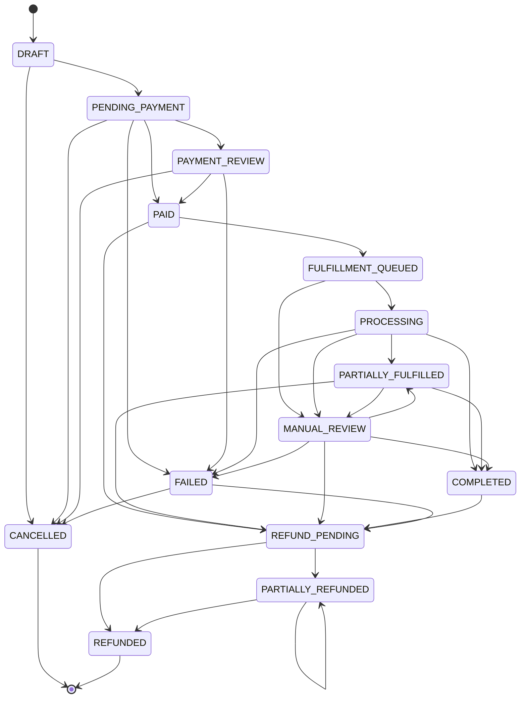

# Order State Machine

Source of truth: [`apps/api/src/orders/order-state-machine.ts`](../apps/api/src/orders/order-state-machine.ts).

`Order.status` only ever moves along an explicit allow-list of transitions. Anything not
listed is rejected with `InvalidOrderTransitionError` — a bad webhook replay, a retried
job, or a bug elsewhere can never silently push an order into an inconsistent state.

## How a transition is applied

`OrderStateMachine.transition(tx, orderId, from, to, actor, reason, correlationId)`:

1. Checks `(from, to)` against the allow-list — throws if not allowed.
2. Runs `UPDATE orders SET status = $to WHERE id = $orderId AND status = $from`. If zero
   rows match, another process already moved the order off `from` (a concurrent webhook
   or retry) — this throws too, rather than silently overwriting unexpected state.
3. Inserts an `OrderStatusEvent` row (`fromStatus`, `toStatus`, `actorType`, `actorId`,
   `reason`, `correlationId`) — this is the append-only timeline shown on the order
   tracking page and in the admin panel.

**Every call must run inside the same Prisma transaction as whatever side effect
triggered it** (payment capture, fulfillment completion, refund). That's what makes the
`PAID → FULFILLMENT_QUEUED` transition, the `Fulfillment` row creation, and the
`OutboxEvent` insert in `PaymentsService.processGatewayEvent` atomic — see
[PAYMENT_INTEGRATION.md](./PAYMENT_INTEGRATION.md).

## Verified, not just typechecked

This flow was exercised against a real (locally-run, non-Docker) Postgres instance during
development: `DRAFT → PENDING_PAYMENT → PAID → FULFILLMENT_QUEUED` via a live
`POST /checkout` → `POST /payments/mock/:id/confirm` → `GET /orders/:orderNumber`
round trip, including confirming the same mock payment twice to prove the webhook path
is idempotent (one `Fulfillment` row, one `OutboxEvent`, no duplicate state change).

## What's not built yet

- Nothing currently drives `FULFILLMENT_QUEUED → PROCESSING` onward — that's the worker
  (Phase 4), which will consume `fulfillment.queued` outbox events.
- `MANUAL_REVIEW` and `REFUND_PENDING → …` have no admin UI yet to act on them.
