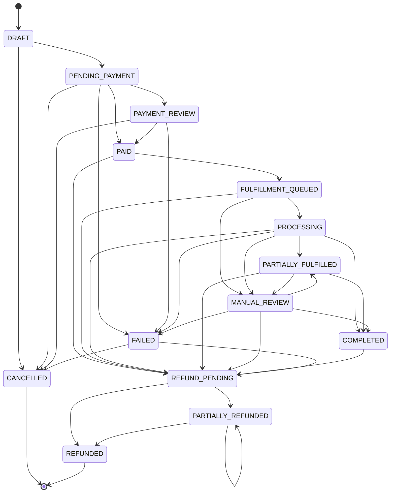

# Order State Machine

Source of truth: [`packages/db/src/order-state-machine.ts`](../packages/db/src/order-state-machine.ts)
— framework-agnostic (no NestJS import) so both `apps/api` and `apps/worker` depend on
one definition of "which transitions are legal," not two copies that could drift apart.

`Order.status` only ever moves along an explicit allow-list of transitions. Anything not
listed is rejected with `InvalidOrderTransitionError` — a bad webhook replay, a retried
job, or a bug elsewhere can never silently push an order into an inconsistent state.

## How a transition is applied

`OrderStateMachine.transition(tx, orderId, from, to, actor, reason, correlationId)`:

1. Checks `(from, to)` against the allow-list — throws if not allowed.
2. Runs `UPDATE orders SET status = $to WHERE id = $orderId AND status = $from`. If zero
   rows match, another process already moved the order off `from` (a concurrent webhook,
   retry, or admin action) — this throws too, rather than silently overwriting
   unexpected state.
3. Inserts an `OrderStatusEvent` row (`fromStatus`, `toStatus`, `actorType`, `actorId`,
   `reason`, `correlationId`) — this is the append-only timeline shown on the order
   tracking page and in the admin panel.

**Every call must run inside the same Prisma transaction as whatever side effect
triggered it** (payment capture, fulfillment completion, refund). That's what makes the
`PAID → FULFILLMENT_QUEUED` transition, the `Fulfillment` row creation, and the
`OutboxEvent` insert in `PaymentsService.processGatewayEvent` atomic — see
[PAYMENT_INTEGRATION.md](./PAYMENT_INTEGRATION.md).

## Why `FULFILLMENT_QUEUED`/`PROCESSING` can go straight to `REFUND_PENDING`

Money is already captured by the time an order reaches either state, so a refund needs
to be reachable from there too — a customer can ask to cancel before fulfillment
finishes, and an admin needs a way to act on that. This wasn't true in an earlier
version of this file (only `PAID`/`PARTIALLY_FULFILLED`/`COMPLETED`/`FAILED`/
`MANUAL_REVIEW` allowed it), which meant almost no real order could ever be refunded —
found while actually building the refund flow, not during design, which is exactly the
kind of gap that stays invisible until something tries to use the "obviously correct"
version.

**Known unhandled race**: if the worker is mid-job on an order (`PROCESSING`) at the
exact moment an admin refunds it, whichever transition loses (`transition()`'s
`updateMany` matches 0 rows) throws rather than corrupting state — but nothing retries
or reconciles the loser automatically yet.

## Verified against real infrastructure, not just typechecked

- `DRAFT → PENDING_PAYMENT → PAID → FULFILLMENT_QUEUED` via a live `POST /checkout` →
  `POST /payments/mock/:id/confirm` → `GET /orders/:orderNumber` round trip, including
  confirming the same mock payment twice to prove the webhook path is idempotent (one
  `Fulfillment` row, one `OutboxEvent`, no duplicate state change).
- `FULFILLMENT_QUEUED → PROCESSING → {COMPLETED, MANUAL_REVIEW, FAILED}` via the worker
  — both the business logic directly (`processFulfillmentJob`, all 5 provider-outcome
  scenarios) and the real `OutboxEvent → BullMQ → Worker` pipeline end to end in CI (a
  real Redis service container, since this environment has neither Docker nor a Windows
  Redis build). See `docs/PROVIDER_INTEGRATION.md`.
- All of the above are now permanent, committed, `DATABASE_URL`/`REDIS_URL`-gated tests
  that run for real in CI on every push, not one-off manual checks.

## What's not built yet

- No admin UI action for `MANUAL_REVIEW` beyond seeing it in the timeline — no
  "retry fulfillment" or "resolve manually" button yet.
- The refund→`REFUND_PENDING` race described above has no automatic recovery.
